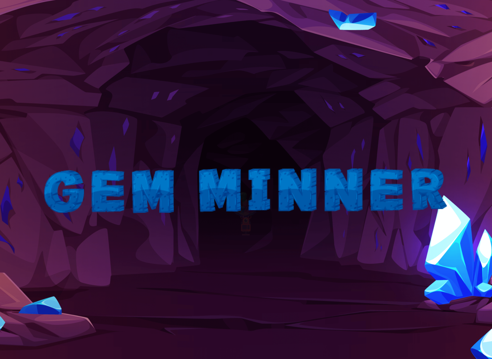
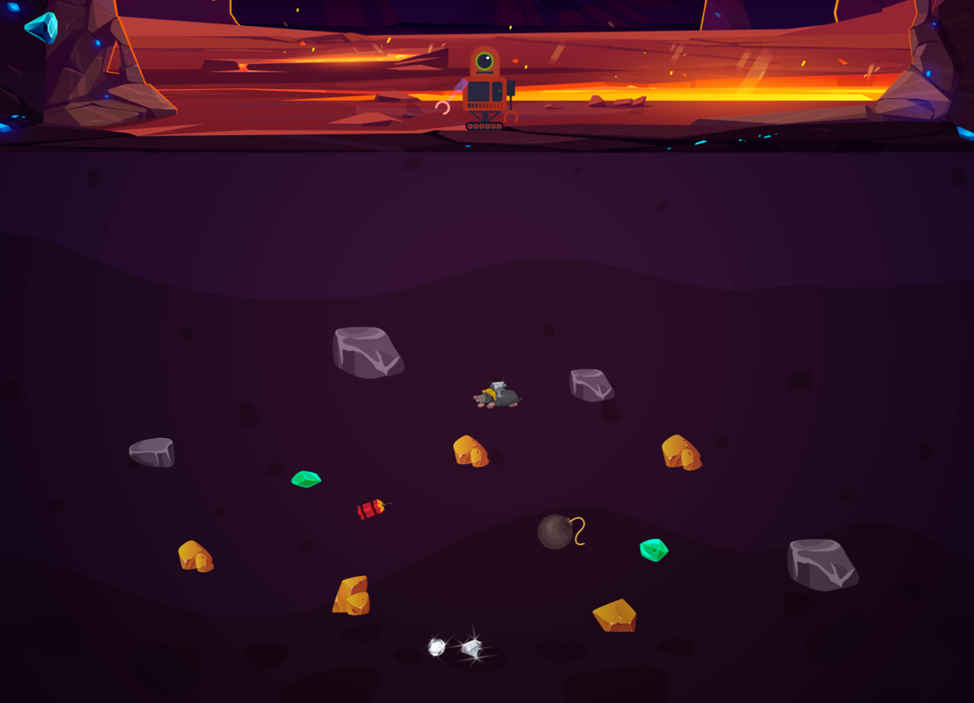
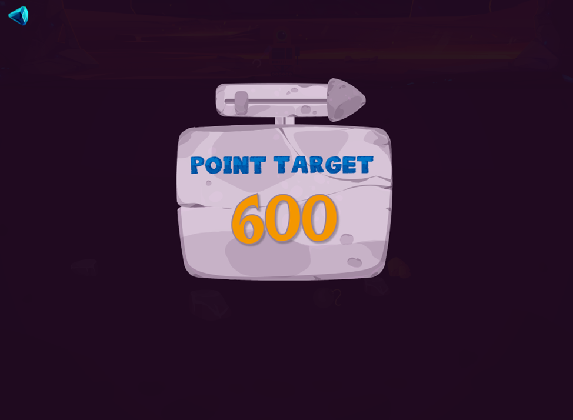
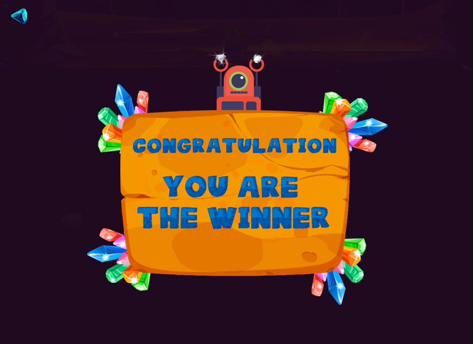

# 🪨 Gold Miner - OOP Game 💎



Gold Miner is an engaging arcade-style game where players control a mechanical claw to collect valuable items from underground. Strategically grab gold nuggets, precious gems, and mystery boxes while avoiding dangerous bombs to reach target scores and advance through challenging levels.

## ✨ Features

- **🎮 Simple but addictive gameplay**: Control a mechanical claw with precise timing
- **📈 Multiple progressive levels**: Increasing difficulty with higher target scores
- **🏆 Diverse collectible items**: Gold nuggets of different sizes, diamonds, rubies, and more
- **💣 Obstacles and challenges**: Avoid bombs and strategically plan your moves
- **🎁 Special items**: Mystery boxes with random rewards and power-ups
- **🐭 Moving targets**: Catch quick-moving moles for bonus points
- **🔊 Engaging sound effects**: Immersive audio experience for game events

## 🎮 How to Play

1. **Control the Claw**: Watch as the claw swings back and forth automatically
2. **Time Your Drop**: Click to release the claw when it's positioned over valuable items
3. **Collect Items**: The claw will grab the item and automatically return to the top
4. **Score Points**: Each item has different point values based on rarity and size
5. **Complete Levels**: Reach the target score before time runs out to advance
6. **Special Items**:
   - 💎 Diamonds and rubies are worth high points
   - 🪨 Rocks are worth less but easier to catch
   - 🐭 Moles move horizontally and require careful timing
   - 💣 Bombs will explode when grabbed, destroying nearby items
   - 🎁 Mystery boxes contain random surprises and power-ups

## 🚀 Installation and Setup

### Prerequisites
- Java Development Kit (JDK) 17 or 19 recommended
- JavaFX (included in most JDK distributions)

### Steps to Run
1. Clone the repository:
   ```bash
   git clone https://github.com/phongnickchinh/goldminer_OOP20232.git
   ```

2. Navigate to the project directory:
   ```bash
   cd goldminer_OOP20232
   ```

3. Compile and run the game:
   ```bash
   javac -p src/main/java com/oop/Main.java
   java -p src/main/java com.oop.Main
   ```

Alternatively, you can import the project into your favorite Java IDE (IntelliJ IDEA, Eclipse, etc.) and run it from there.

## 📸 Screenshots


*The first chapter*


*Exciting gameplay in action*


*Game completion celebration*

## 🎮 Game Controls

- **Mouse Click**: Release the claw to grab items
- **Exit Button**: Return to the main menu

## 🏆 Scoring System

| Item | Points |
|------|--------|
| Small Gold | 50 |
| Medium Gold | 100 |
| Large Gold | 500 |
| Diamond | 500 |
| Ruby | 600 |
| Rock | 20-50 |
| Mole | 200-400 |

## 🧑‍💻 Development

This game was developed as a project for Object-Oriented Programming course 2023-2024. It demonstrates key OOP principles including:
- Inheritance and polymorphism with game objects
- Encapsulation of game mechanics
- Interface implementation for consistent behavior
- Design patterns for efficient code structure

## 🙏 Credits

- Game Development: [Team 81]
- Artwork and Sprites: [Phạm Văn Phong]
- Sound Effects: [Web source]
---

Enjoy the game! 🎮✨
